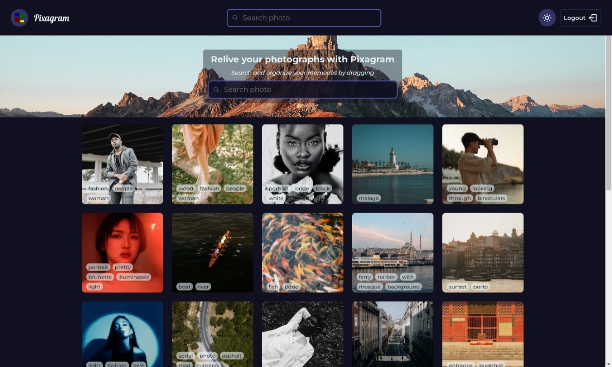

# 📗 Table of Contents <a name="readme-top"></a>

- [📗 Table of Contents ](#-table-of-contents-)
  - [📖 Pixagram ](#-pixagram-)
  - [🛠 Built With ](#-built-with-)
    - [⚙️ Tech Stack ](#️-tech-stack-)
    - [💡 Key Features ](#-key-features-)
  - [💻 Preview ](#-preview-)
  - [🚀 Live Link ](#-live-link-)
  - [💻 Getting Started ](#-getting-started-)
    - [Prerequisites](#prerequisites)
    - [Setup](#setup)
    - [Install](#install)
    - [Usage](#usage)
  - [👥 Authors ](#-authors-)
  - [🔭 Future Features ](#-future-features-)
  - [🤝 Contributing ](#-contributing-)
  - [⭐️ Show your support ](#️-show-your-support-)
  - [❓ FAQ ](#-faq-)
  - [🙏 Acknowledgments ](#-acknowledgments-)

## 📖 Pixagram <a name="pixagram"></a>

> `Pixagram` is a responsive image web gallery that showcases a collection of images. Users can login to the gallery page, rearrange their images by dragging and dropping.

## 🛠 Built With <a name="built-with"></a>

### ⚙️ Tech Stack <a name="tech-stack"></a>

> Here are the tech stacks applied in this project.

<details>
  <summary>Language</summary>
  <ul>
    <li><a href="https://www.typescriptlang.org/">JavaScript</a></li>
  </ul>
</details>

<details>
  <summary>Frameworks</summary>
  <ul>
    <li><a href="https://react.dev/">React</a></li>
  </ul>
</details>

<p align="right">(<a href="#readme-top">back to top</a>)</p>

### 💡 Key Features <a name="key-features"></a>

> The following are the key features of the app

- Login
- Rearrange gallery
- Search pictures

<p align="right">(<a href="#readme-top">back to top</a>)</p>

## 💻 Preview <a name="preview"></a>

> Coming soon...

<!-- -->

## 🚀 Live Link <a name="live-endpoint"></a>

> Coming soon...

<!-- [Movie Box](https://imdb-movie-box.netlify.app/) -->

<!--  -->

<p align="right">(<a href="#readme-top">back to top</a>)</p>

<!-- GETTING STARTED -->

## 💻 Getting Started <a name="getting-started"></a>

### Prerequisites

> The following applications are required to be installed for the project to run!

- Install a modern browser e.g [Google Chrome](https://www.google.com/chrome/), [Edge](https://www.microsoft.com/en-us/edge?r=1), [Firefox](https://www.mozilla.org/en-US/exp/firefox/new/) etc.
- Install [Git](https://git-scm.com/downloads)

### Setup

Clone this repository to your desired folder:

```sh
  git clone git@github.com:PraisesPJMT/pixagram.git
  cd pixagram
```

### Install

Install this project with:

```sh
  npm install
```

### Usage

To run the project, execute the following command:

```sh
  npm run dev
```

- After running `npm run dev`, use the app on [http://localhost:5173/](http://localhost:5173/) in the browser!
- For more information please visit [Vite](https://vitejs.dev/guide/).

<p align="right">(<a href="#readme-top">back to top</a>)</p>

## 👥 Authors <a name="authors"></a>

👤 **Praises Tula**

[](https://github.com/PraisesPJMT/)
[](https://www.linkedin.com/in/praises-tula/)
[](https://twitter.com/PraisesPJMT/)

[](mailto:praisesmusa@gmail.com)
[](https://angel.co/u/praises-tula/)

## 🔭 Future Features <a name="future-features"></a>

> The following are features to be expected in the future

- [ ] **Stream a movie**

<p align="right">(<a href="#readme-top">back to top</a>)</p>

## 🤝 Contributing <a name="contributing"></a>

Contributions, issues, and feature requests are welcome!

Feel free to check the [issues page](../../issues/).

<p align="right">(<a href="#readme-top">back to top</a>)</p>

## ⭐️ Show your support <a name="support"></a>

Give a ⭐️ if you like this project!

<p align="right">(<a href="#readme-top">back to top</a>)</p>

## ❓ FAQ <a name="faq"></a>

- **How I can run this project?**

  - After cloning repository, run `npm install` to install all dependencies. Then run `npm run dev` to run the project.

<p align="right">(<a href="#readme-top">back to top</a>)</p>

## 🙏 Acknowledgments <a name="acknowledgements"></a>

> - Special thanks to Zuri HNGx for this project

<!-- > - FIGMA design is gotten here [FIGMA UI](<https://www.figma.com/file/tVfgoNfhYkQaUkh8LGqRab/MovieBox-(Community)?type=design&node-id=1220-324&mode=design&t=6998DWtjQrxz8mOf-0>) -->

> - Tip hart to you for checking this project out

<p align="right">(<a href="#readme-top">back to top</a>)</p>
